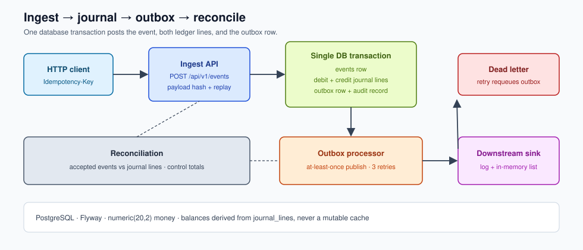

# Financial Event Ledger

A Spring Boot service that ingests financial posting events, journals them onto a double-entry ledger with exact decimal arithmetic, publishes downstream work through a transactional outbox, and reconciles ingested events against posted journal lines.

Portfolio project using fictional data. It is not connected to an employer, client, or production system.

[](https://github.com/damian123/financial-event-ledger-java/actions/workflows/ci.yml)

## What problem this solves

Operational finance systems receive the same posting more than once, from more than one producer, and still have to land **exactly one** balanced journal entry. Float rounding, a cached running balance, or a message published outside the posting transaction will silently drift the books.

This service treats that as the core problem: accept an event once, post a debit and a credit in the same database transaction, record an outbox row beside those lines, and prove later that the journal still matches the accepted events.

## Architecture



`POST /api/v1/events` is the write path. The ingest transaction inserts the event, two `journal_lines` rows (debit and credit), an `outbox` row, and an audit record. A scheduled processor then publishes pending outbox rows to an in-process sink. `POST /api/v1/reconciliations/run` compares accepted events to journal lines and stores a report with control totals.

## Five key capabilities

1. **Idempotent ingest** — `Idempotency-Key` is required. The same key with the same payload returns the original result (`200`). The same key with a different payload returns `409 Conflict`.
2. **Double-entry journal** — every accepted event posts a debit and a credit in one transaction. Account balances are sums of `journal_lines`, not a mutable cache.
3. **Transactional outbox** — the outbox row is inserted with the journal lines. A processor publishes at-least-once and marks the row published. After three failures the work moves to `dead_letters`.
4. **Reconciliation** — a stored report flags missing journals, unbalanced debit/credit pairs, and duplicate event ids, with debit, credit, and accepted-amount control totals.
5. **Append-only audit** — ingest, conflict, post, reverse, reconcile, dead-letter, and retry are recorded and listed at `GET /api/v1/events/{eventId}/audit`.

OpenAPI is served at [`/swagger-ui/index.html`](http://localhost:8080/swagger-ui/index.html).

## Two-minute run

Requires Java 26 and Docker.

```bash
docker compose up -d
./gradlew bootRun
```

The API listens on `http://localhost:8080`. Flyway applies the schema and five fictional seed accounts (`CASH-USD`, `CASH-EUR`, `DEPOSITS-USD`, `FEE-INCOME-USD`, `CLEARING-USD`).

```bash
curl -s -X POST http://localhost:8080/api/v1/events \
  -H 'Content-Type: application/json' \
  -H 'Idempotency-Key: demo-1' \
  -d '{
    "eventId": "evt-demo-1",
    "accountId": "11111111-1111-1111-1111-111111111111",
    "counterAccountId": "33333333-3333-3333-3333-333333333333",
    "amount": "25.50",
    "currency": "USD",
    "type": "POSTING",
    "occurredAt": "2026-03-01T12:00:00Z",
    "description": "Fictional customer deposit"
  }'

curl -s http://localhost:8080/api/v1/accounts/11111111-1111-1111-1111-111111111111/balance
curl -s -X POST http://localhost:8080/api/v1/reconciliations/run
```

`amount` is a decimal string. Scale greater than 2 is rejected; the service never rounds money.

## Verification and CI

```bash
./gradlew test
```

Integration tests start PostgreSQL with Testcontainers and cover happy-path posting, idempotent replay, conflicting keys, scale rejection, reversals, forced imbalance, dead-letter after three publish failures, and concurrent duplicate ingest.

GitHub Actions runs `./gradlew --no-daemon check` on Java 26.

## Important design decisions

- **Exact decimals.** Amounts are `numeric(20,2)` / `BigDecimal`. `RoundingMode.UNNECESSARY` is used when scaling to cents so a third decimal place cannot slip through.
- **Journal as source of truth.** `GET /api/v1/accounts/{id}/balance` aggregates journal lines. Signed balance follows the account type (debit-normal for assets and expenses).
- **Idempotency is a unique key plus a payload hash.** Concurrent duplicates hit `uq_events_idempotency_key`; the losing request reloads the winner and either replays or conflicts.
- **Outbox in the posting transaction.** Downstream work cannot be "sent" unless the journal commit succeeds. The demo publisher is in-process so tests can observe publication without a broker.
- **Reversal is an offsetting pair.** `REVERSAL` credits the primary account and debits the counter-account so a later reverse of the same amount nets to zero.

## Limitations

See [LIMITATIONS.md](LIMITATIONS.md). Short version: no auth, single-node outbox poller, not a production ledger, fictional data.
